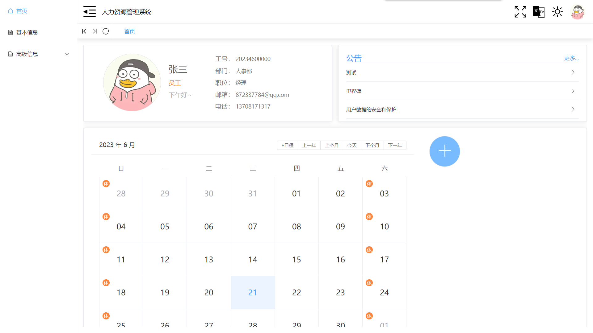

# 人力资源管理系统

## 准备

```
npm install
```

## 开始

```
npm run start:dev
```

## 项目介绍

### 基本介绍

这是一个人力资源管理系统，包括登录、首页、信息展示、人事管理、系统管理、统计管理等功能

### 技术栈

vue3+vue-router+pinia+axios+typeScript+vue-i18n+echarts

### 登录


### 首页



### 基本信息


### 高级信息


### 统计管理


### 员工管理


### 权限管理


### 薪资管理


# 2023/4/4

## BUG

1. （已修复）Dialog 组件有时会保留上次数据，测试正常，不定触发。（defalutDataHandler）

## 内容

1. 修改 defalutDataHandler 逻辑保证添加状态时，也可以有值
2. 添加表单验证方法 validateNumber，用于验证数字类型
3. 完成奖惩规则管理、部门管理、工作状态管理、账套管理
4. 添加 getLabelByOptionData、getValueByOptionData 用于获取 el-option 的 label 和 value
5. 显示被软删除的数据，并且可以进行恢复和真删除

# 2023/4/5

## BUG

1. （后端）权限设置的 menuTree 只有两层
2. （已解决）传递 editabled 为 false 后，添加事件失灵（7）

## 内容

1. 完成权限管理、日志管理、公告管理、员工管理部分
2. 修改 Container 组件，新增 toolButtons 可以传入字符串数组控制功能按钮的显示与隐藏
3. 修改 Container 组件，新增 operationButtons 可以传入字符串数组控制 table 内功能按钮的显示与隐藏
4. 批量修改和批量删除按钮在对应状态显示
5. 修改 Container 组件，保证 editabled 字段的传输
6. 修改 Dialog 组件，传递类名控制 Dialog 样式
7. 修改 Dialog 组件，confirmHandler 判断 props.editabled ===> props.editabled || type.value === ADD,保证添加时可以通过判断
8. 修改 Dialog 组件,可以 drawer 修改 ElDialog 为 ElDrawer 组件

## TODO

1. 计算 el-table 每列最大宽度，实现一行展示
2. 显示 label 值，el-select 不高亮显示

# 2023/4/6

## 内容

1. 完善部门和职位的逻辑，通过职位获取基本工资
2. 修改添加员工页面，获取头像并展示
3. 完成员工管理
4. 添加 validatePhone 用来验证手机号，validateIdCard 用来验证身份证
5. 获取 workStateOption
6. 完成管理员管理、申请管理、奖惩管理、调薪管理、调动管理部分

# 2023/4/8

## 内容

1. 修改 getLabelByOptionData、getValueByOptionData 没有数据时报错
2. 完成管理员管理、申请管理、奖惩管理、调薪管理、调动管理
3. 调整 Container 样式，保证样式一致性

## TODO

1. 管理员管理级联选择器显示名称

# 2023/4/9

## BUG

1. el-select 中 el-option 的 lable 显示不出来，显示的是 value 的值

## 内容

1. 完成角色、奖惩、调薪、调动 Dialog 页面
2. 员工管理页面新增权限展示
3. 修改 Dialog 组件，可以自定义整个操作列

# 2023/4/10

## 内容

1. 修改 Container 组件，可以通过 card 控制是否生成 elcard，通过 operation 控制是否生成操作列
2. 完成员工信息：基本信息、奖惩信息、调薪信息、调动信息、首页部分

# 2023/4/12

## BUG

1. （已解决）申请管理中 card 控制 elcard 后，eltable 失去高度

## 内容

1. 完成申请管理、申请信息
2. 修改 Container 组件，现在可以通过 card 修改全部的 elcard 生成
3. 添加 ApplyStateEnum
4. 添加 selectApplyStateTagType 获取审核状态 eltag 信息
5. 添加 ApplyDialog 组件，用于申请管理展示
6. 修改样式给 div 添加高度

## TODO

1. ApplyDialog 组件驳回申请后，需要填入驳回理由
2. 申请信息的操作
3. 状态更新提示

# 2023/4/14

## 内容

1. 修改 Container 组件，将内置功能按钮重新放在插槽外
2. 完成薪资信息

# 2023/4/16

## 内容

1. 引入 echarts
2. 完成薪资统计部分

# 2023/4/17

## 内容

1. 完成薪资统计

# 2023/4/18

## BUG

1. （已解决）薪资统计的年份删除后会报错 3.
2. （已解决）? echarts 使用饼图的时候返回的数据类型为{code:number,count:number|string}时，会将 code 作为数据显示，返回数据调整为{code:string,count:number}

## 内容

1. 完成操作统计
2. 修改薪资统计，可以将搜索条件的年份进行删除
3. echarts 中 dataset 的 dimensions 在返回值为空的时候，进行置空

# 2023/4/19

## 内容

1. 完成日历日程的添加与显示
2. 引入 moment 库进行时间的处理

# 2023/4/20

## 内容

1. 修改了薪资表，修改了薪资信息的展示信息
2. 修改获取日历信息接口，删除所需的开始时间和结束时间，添加员工 ID
3. 删除获取开始时间和结束时间的 saveDate 方法
4. 获取日历信息后遍历开始定时器 setInterval，到提示时间后进行提醒，关闭提醒后删除日程、定时器
5. 添加修改员工信息功能、修改密码功能、修改头像功能

# 2023/4/27

## BUG

1. （已解决）权限设置跳转到其他页面没有动画

## 内容

1. 修改修改头像功能
2. 添加部分动画
3. 调整首页快速开始逻辑
